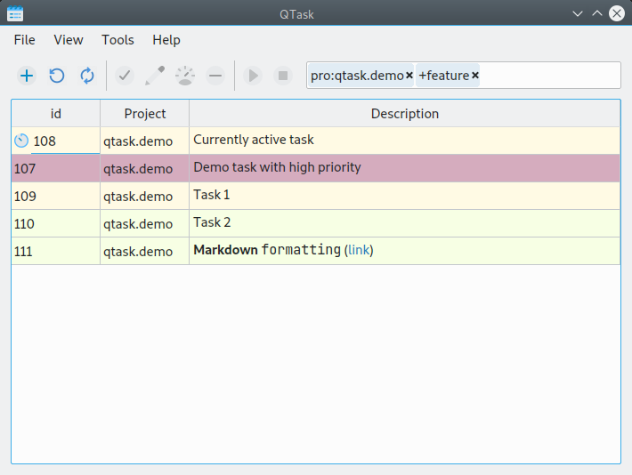

# QTask


[](https://opensource.org/licenses/MIT)

QTask is an open-source Qt-based graphical user interface for managing tasks. It is based on [Taskwarrior](https://taskwarrior.org/), a popular command-line organizer.

## Features



The goal of this application is to allow users to manage task list quickly using mostly the keyboards shortcuts while still having a user-friendly graphical user interface.

You may find the following features of this utility useful:

* Convenient GUI for adding, deleting, and editing tasks;
* Filters to quickly sort tasks based on Taskwarrior commands;
* Keyboard shortcuts for all common actions;
* Access to Taskwarrior CLI commands via the built-in shell;
* This utility monitors changes in the database in the background. Therefore, you will always see new tasks as they arrive. This is useful if you are using the Taskwarrior CLI or scripts like [bugwarrior](https://github.com/ralphbean/bugwarrior) at the same time.

If you have any ideas on how to improve this utility, feel free to create an [issue](https://github.com/jubnzv/qtask/issues) or open a [PR](https://github.com/jubnzv/qtask/pulls).

## Installation

Arch Linux users could use AUR to install `qtask`:
```bash
yay -S qtask-git
```

On other distributions you'll need to build it from sources.

### Building from source

First, make sure you have Qt installed.
The project supports both Qt 5 (≥ 5.14) and Qt 6, and will automatically use the newest available version detected by CMake.

On Debian-based distributions, you can install the required dependencies with:

```bash
# For Qt 5
sudo apt install qt5-default qttools5-dev libqt5svg5-dev libx11-xcb-dev qtbase5-private-dev

# Or, for Qt 6 (recommended)
sudo apt install qt6-base-dev qt6-tools-dev qt6-svg-dev libx11-xcb-dev
```
CMake will detect your installed Qt version automatically and build the project with the latest one available.


Clone the repository with submodules:

```bash
git clone --recurse-submodules https://github.com/jubnzv/qtask.git qtask
cd qtask
```

Build QTask in the build directory:

```bash
mkdir build
cd build
cmake -DCMAKE_BUILD_TYPE=Release ..
cmake --build .
```

Then you can install the compiled binary:

```bash
sudo make install
```
